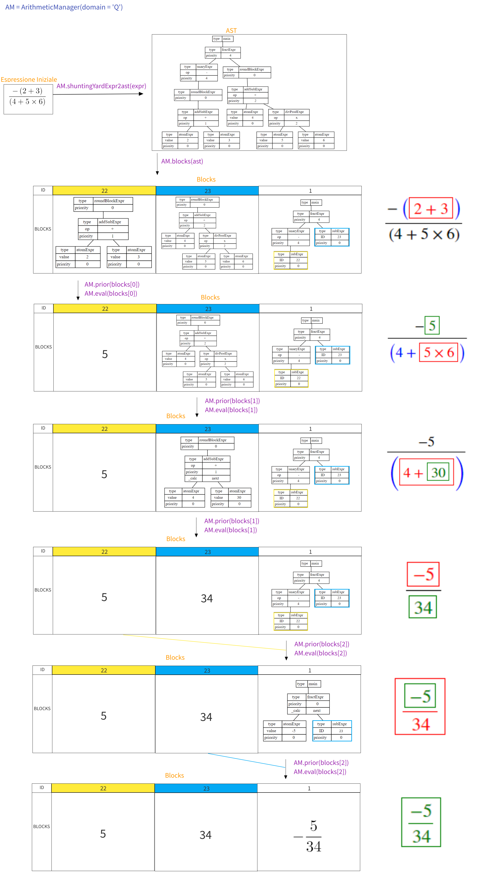

# Progetto di Linguaggi e Traduttori Valerio Cislaghi

Tutorial

Creare un oggetto di tipo ArithmeticManager(*domain*) che riceve il dominio in cui l'espressione aritmetica deve essere valutata

possibili domini: 'N', 'Z', 'Q', 'R'

<pre>
AM = ArithmeticManager('Q')
</pre>

Per il parsing di un'espressione chiamare il metodo shuntingYardExpr2ast della classe ArithmeticManager, il quale restituirà un AST con annotazioni riguardo la priorità di ogni espressione per guidare il walker alla valutazione step by step.

<pre>
ast = AM.shuntingYardExpr2ast(expr)
</pre>

Utilizzare il metodo blocks della classe ArithmeticManager per suddividere l'espressioni in blocchi, ogni blocco non sarà altro che l'AST di una sottoespressione.
la lista di sottoespressioni restituita sarà ordinata secondo l'ordine di esecuzione. Quindi la prima sottoespressione della lista sarà quella da eseguire per prima.
se una espressione A contiene una sottoespressione B al suo interno, l'AST di A conterrà un'ID che identifica univocamente la sottoespressione B (guarda lo schema sotto per capire meglio).
Dovrà essere utilizzata una memoria aggiuntiva per contenere i risultati delle sottoespressioni già valutate.
il metodo blocks inoltre fa inferenza sul tipo di parentesizzazione adottato ed eventualmente lancia un'eccezione nel caso in cui la parentesizzazione non sia consentita (potrebbe essere svolto direttamente dal parser).
<pre>
blocks = AM.blocks(ast)
MEMORY = dict(blocks)
</pre>

P possiamo passare alla valutazione step by step dell'espressione aritmetica.
Il metodo prior della classe ArithmeticManager ha il compito di
* Annotare il noto che contiene l'espressione da calcolare
* Annotare l'ast passato in input con le nuove priorità non considerando più l'espressione che sarà calcolata. *
* Restituire il parent del nodo che si deve valutare in quello step

Le annotazioni sull'AST definite dal metodo prior serviranno anche al metodo latex (che stampa l'espressione corrente secondo le regole stabilite).

il metodo eval riceve in input un AST e restituisce un valore ottenuto valutando l'espression, chiede inoltre un dizionario che rappresenta la "memoria di esecuzione", nel caso in cui debba essere valutata un'espressione che contiene una sottoespressione al suo interno.
<pre>
while blocks:
    block_id, current_block = blocks[0]
    parent_to_calc = AM.prior(current_block)
    tex = AM.latex(main_block, MEMORY)
        
    parent_to_calc.children =  [Tree({'type': 'atomExpr', 'value': AM.eval(child, MEMORY), 'priority': 0, '_calc': 'last'}, []) 
                                    if is_next_to_calc(child) else child
                                    for child in parent_to_calc.children]

    if is_calculable(current_block):
        current_block = current_block.children[0]
        blocks = blocks[1:]

    MEMORY[block_id] = current_block
</pre>

